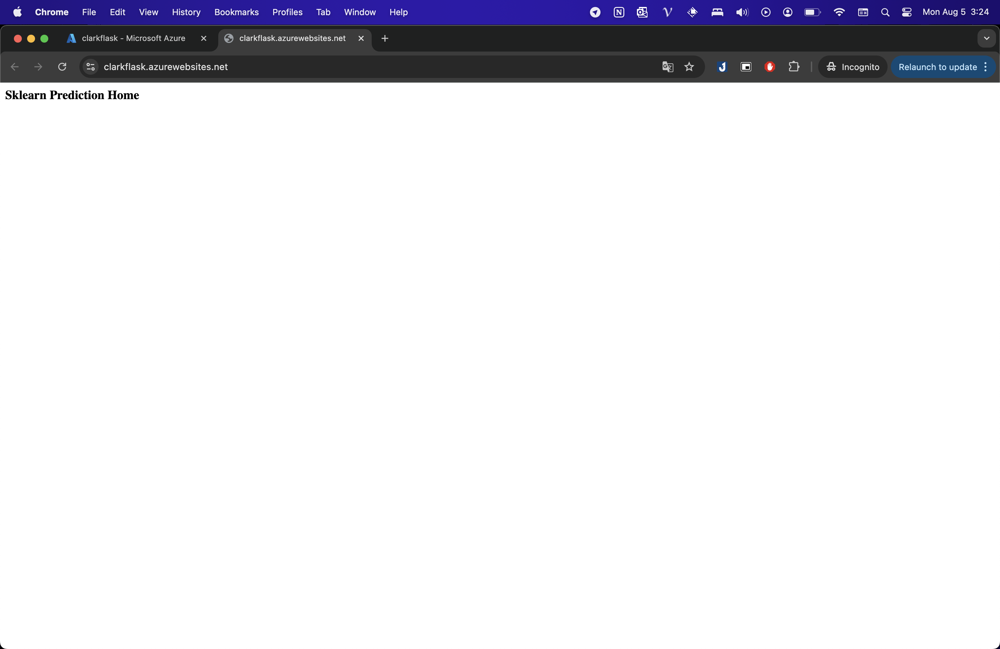
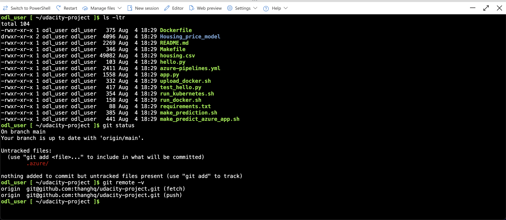
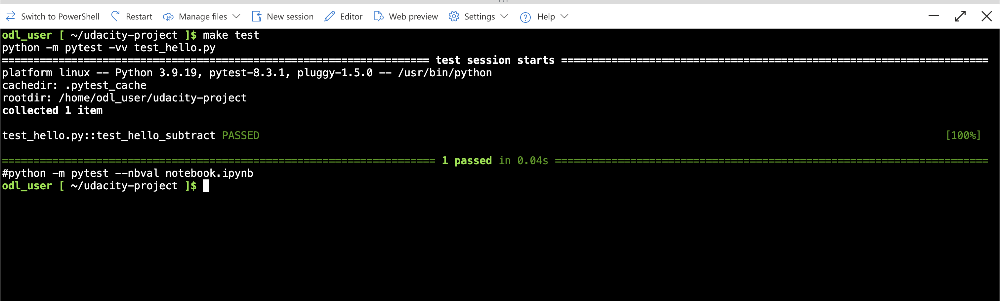
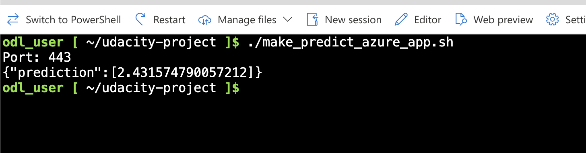

# udacity-project

[](https://github.com/thanghq/udacity-project/actions/workflows/main.yml)

# Overview

This project aims to predict housing prices using machine learning techniques. The dataset includes various features related to housing properties, and the goal is to build a predictive model that can accurately estimate housing prices based on these features.

## Project Plan

* [Trello board](https://trello.com/invite/b/66af281765256e275f7768ab/ATTI9d35ff5507b9e98516eecaf31fe802315D42B103/udacity-project).
* [Project Plan - Spread sheet](https://docs.google.com/spreadsheets/d/1EoK3Hnt4g_B5xVHTstJAqLOM0Sxi1cDtSNUjWLBKKH4/edit?usp=sharing).

## Instructions

Architectural: 
* Architectural Diagram (Shows how key parts of the system work)>

How to start project:

* Project running on Azure App Service


* Project cloned into Azure Cloud Shell



* Passing tests that are displayed after running the `make test` command from the `Makefile`


* Successful deploy of the project in Azure Pipelines. 


* Running Azure App Service from Azure Pipelines automatic deployment

* Successful prediction from deployed flask app in Azure Cloud Shell. 

```bash
odl_user [ ~/udacity-project ]$ ./make_predict_azure_app.sh 
Port: 443
{"prediction":[2.431574790057212]}
```


* Sample Output of streamed log files from deployed application
``` bash
2024-08-04T19:03:27.2717419Z 169.254.129.1 - - [04/Aug/2024:19:03:27 +0000] "GET /robots933456.txt HTTP/1.1" 404 207 "-" "HealthCheck/1.0"
2024-08-04T19:03:27.2745555Z 169.254.129.1 - - [04/Aug/2024:19:03:27 +0000] "GET /robots933456.txt HTTP/1.1" 404 207 "-" "HealthCheck/1.0"
2024-08-04T19:03:27.2769145Z 169.254.129.1 - - [04/Aug/2024:19:03:27 +0000] "GET /robots933456.txt HTTP/1.1" 404 207 "-" "HealthCheck/1.0"
2024-08-04T19:03:27.2799313Z 169.254.129.1 - - [04/Aug/2024:19:03:27 +0000] "GET /robots933456.txt HTTP/1.1" 404 207 "-" "HealthCheck/1.0"
2024-08-04T19:03:27.2809570Z 169.254.129.1 - - [04/Aug/2024:19:03:27 +0000] "GET /robots933456.txt HTTP/1.1" 404 207 "-" "HealthCheck/1.0"
2024-08-04T19:03:27.2829421Z 169.254.129.1 - - [04/Aug/2024:19:03:27 +0000] "GET /robots933456.txt HTTP/1.1" 404 207 "-" "HealthCheck/1.0"
2024-08-04T19:03:27.2835660Z 169.254.129.1 - - [04/Aug/2024:19:03:27 +0000] "GET /robots933456.txt HTTP/1.1" 404 207 "-" "HealthCheck/1.0"
2024-08-04T19:03:27.2844351Z 169.254.129.1 - - [04/Aug/2024:19:03:27 +0000] "GET /robots933456.txt HTTP/1.1" 404 207 "-" "HealthCheck/1.0"
2024-08-04T19:03:27.2892223Z 169.254.129.1 - - [04/Aug/2024:19:03:27 +0000] "GET /robots933456.txt HTTP/1.1" 404 207 "-" "HealthCheck/1.0"
2024-08-04T19:03:27.2901770Z 169.254.129.1 - - [04/Aug/2024:19:03:27 +0000] "GET /robots933456.txt HTTP/1.1" 404 207 "-" "HealthCheck/1.0"
2024-08-04T19:03:27.2911424Z 169.254.129.1 - - [04/Aug/2024:19:03:27 +0000] "GET /robots933456.txt HTTP/1.1" 404 207 "-" "HealthCheck/1.0"
2024-08-04T19:03:27.2923551Z 169.254.129.1 - - [04/Aug/2024:19:03:27 +0000] "GET /robots933456.txt HTTP/1.1" 404 207 "-" "HealthCheck/1.0"
2024-08-04T19:03:27.2946868Z 169.254.129.1 - - [04/Aug/2024:19:03:27 +0000] "GET /robots933456.txt HTTP/1.1" 404 207 "-" "HealthCheck/1.0"
2024-08-04T19:03:27.2959371Z 169.254.129.1 - - [04/Aug/2024:19:03:27 +0000] "GET /robots933456.txt HTTP/1.1" 404 207 "-" "HealthCheck/1.0"
2024-08-04T19:03:27.2971482Z 169.254.129.1 - - [04/Aug/2024:19:03:27 +0000] "GET /robots933456.txt HTTP/1.1" 404 207 "-" "HealthCheck/1.0"
2024-08-04T19:03:27.3029136Z 169.254.129.1 - - [04/Aug/2024:19:03:27 +0000] "GET /robots933456.txt HTTP/1.1" 404 207 "-" "HealthCheck/1.0"
2024-08-04T19:03:27.3040224Z 169.254.129.1 - - [04/Aug/2024:19:03:27 +0000] "GET /robots933456.txt HTTP/1.1" 404 207 "-" "HealthCheck/1.0"
2024-08-04T19:03:27.9428425Z [2024-08-04 19:03:27 +0000] [93] [INFO] Handling signal: term
2024-08-04T19:03:28.0694462Z [2024-08-04 19:03:27 +0000] [96] [INFO] Worker exiting (pid: 96)
2024-08-04T19:24:05.3390538Z 169.254.129.1 - - [04/Aug/2024:19:24:04 +0000] "GET / HTTP/1.1" 200 32 "https://sandbox-1.reactblade.portal.azure.net/" "Mozilla/5.0 (Macintosh; Intel Mac OS X 10_15_7) AppleWebKit/537.36 (KHTML, like Gecko) Chrome/127.0.0.0 Safari/537.36"
2024-08-04T19:39:21.2978931Z    _____
2024-08-04T19:39:21.2989991Z   /  _  \ __________ _________   ____
2024-08-04T19:39:21.2990277Z  /  /_\  \\___   /  |  \_  __ \_/ __ \
2024-08-04T19:39:21.2990347Z /    |    \/    /|  |  /|  | \/\  ___/
2024-08-04T19:39:21.2990440Z \____|__  /_____ \____/ |__|    \___  >
2024-08-04T19:39:21.2990494Z         \/      \/                  \/
2024-08-04T19:39:21.2990554Z A P P   S E R V I C E   O N   L I N U X
2024-08-04T19:39:21.2990602Z
2024-08-04T19:39:21.2990648Z Documentation: http://aka.ms/webapp-linux
2024-08-04T19:39:21.2990692Z Python 3.10.14
2024-08-04T19:39:21.2990737Z Note: Any data outside '/home' is not persisted
2024-08-04T19:39:21.6486208Z Starting OpenBSD Secure Shell server: sshd.
2024-08-04T19:39:21.6878596Z WEBSITES_INCLUDE_CLOUD_CERTS is not set to true.
2024-08-04T19:39:21.7361069Z App Command Line not configured, will attempt auto-detect
2024-08-04T19:39:21.8440410Z Starting periodic command scheduler: cron.
2024-08-04T19:39:21.8455286Z Launching oryx with: create-script -appPath /home/site/wwwroot -output /opt/startup/startup.sh -virtualEnvName antenv -defaultApp /opt/defaultsite
2024-08-04T19:39:21.8840143Z Found build manifest file at '/home/site/wwwroot/oryx-manifest.toml'. Deserializing it...
2024-08-04T19:39:21.8866715Z Build Operation ID: 34195a4f248d16c3
2024-08-04T19:39:21.8887010Z Output is compressed. Extracting it...
2024-08-04T19:39:21.8891311Z Oryx Version: 0.2.20240619.2, Commit: cf006407a02b225f59dccd677986973c7889aa50, ReleaseTagName: 20240619.2
2024-08-04T19:39:21.8904677Z Extracting '/home/site/wwwroot/output.tar.gz' to directory '/tmp/8dcb4bce82fa672'...
2024-08-04T19:39:28.0127115Z App path is set to '/tmp/8dcb4bce82fa672'
2024-08-04T19:39:28.2456937Z Detected an app based on Flask
2024-08-04T19:39:28.2457819Z Generating `gunicorn` command for 'app:app'
2024-08-04T19:39:28.2478263Z Writing output script to '/opt/startup/startup.sh'
2024-08-04T19:39:28.4235940Z Using packages from virtual environment antenv located at /tmp/8dcb4bce82fa672/antenv.
2024-08-04T19:39:28.4239883Z Updated PYTHONPATH to '/opt/startup/app_logs:/tmp/8dcb4bce82fa672/antenv/lib/python3.10/site-packages'
2024-08-04T19:39:28.8359490Z [2024-08-04 19:39:28 +0000] [92] [INFO] Starting gunicorn 22.0.0
2024-08-04T19:39:28.8569397Z [2024-08-04 19:39:28 +0000] [92] [INFO] Listening at: http://0.0.0.0:8000 (92)
2024-08-04T19:39:28.8571562Z [2024-08-04 19:39:28 +0000] [92] [INFO] Using worker: sync
2024-08-04T19:39:28.8625619Z [2024-08-04 19:39:28 +0000] [95] [INFO] Booting worker with pid: 95
2024-08-04T19:39:37.0599292Z 169.254.129.1 - - [04/Aug/2024:19:39:37 +0000] "GET /robots933456.txt HTTP/1.1" 404 207 "-" "HealthCheck/1.0"
2024-08-04T19:39:37.0600758Z 169.254.129.1 - - [04/Aug/2024:19:39:37 +0000] "GET /robots933456.txt HTTP/1.1" 404 207 "-" "HealthCheck/1.0"
2024-08-04T19:39:37.0634078Z 169.254.129.1 - - [04/Aug/2024:19:39:37 +0000] "GET /robots933456.txt HTTP/1.1" 404 207 "-" "HealthCheck/1.0"
2024-08-04T19:39:37.0645246Z 169.254.129.1 - - [04/Aug/2024:19:39:37 +0000] "GET /robots933456.txt HTTP/1.1" 404 207 "-" "HealthCheck/1.0"
2024-08-04T19:39:37.0657644Z 169.254.129.1 - - [04/Aug/2024:19:39:37 +0000] "GET /robots933456.txt HTTP/1.1" 404 207 "-" "HealthCheck/1.0"
2024-08-04T19:39:37.0686194Z 169.254.129.1 - - [04/Aug/2024:19:39:37 +0000] "GET /robots933456.txt HTTP/1.1" 404 207 "-" "HealthCheck/1.0"
2024-08-04T19:39:37.0686474Z 169.254.129.1 - - [04/Aug/2024:19:39:37 +0000] "GET /robots933456.txt HTTP/1.1" 404 207 "-" "HealthCheck/1.0"
2024-08-04T19:39:37.0694132Z 169.254.129.1 - - [04/Aug/2024:19:39:37 +0000] "GET /robots933456.txt HTTP/1.1" 404 207 "-" "HealthCheck/1.0"
2024-08-04T19:39:38.1893150Z [2024-08-04 19:39:38 +0000] [94] [INFO] Handling signal: term
2024-08-04T19:39:38.2675596Z [2024-08-04 19:39:38 +0000] [97] [INFO] Worker exiting (pid: 97)
2024-08-04T19:46:49.9517102Z 169.254.129.1 - - [04/Aug/2024:19:46:49 +0000] "GET / HTTP/1.1" 200 32 "https://sandbox-1.reactblade.portal.azure.net/" "Mozilla/5.0 (Macintosh; Intel Mac OS X 10_15_7) AppleWebKit/537.36 (KHTML, like Gecko) Chrome/127.0.0.0 Safari/537.36"
2024-08-04T19:47:53.3273611Z /tmp/8dcb4bce82fa672/antenv/lib/python3.10/site-packages/sklearn/base.py:376: InconsistentVersionWarning: Trying to unpickle estimator LinearRegression from version 1.1.3 when using version 1.5.1. This might lead to breaking code or invalid results. Use at your own risk. For more info please refer to:
2024-08-04T19:47:53.3274255Z https://scikit-learn.org/stable/model_persistence.html#security-maintainability-limitations
2024-08-04T19:47:53.3274303Z   warnings.warn(
2024-08-04T19:47:53.3329216Z [2024-08-04 19:47:53,259] INFO in app: JSON payload: %s json_payload
2024-08-04T19:47:53.4660948Z [2024-08-04 19:47:53,465] INFO in app: inference payload DataFrame: %s inference_payload
2024-08-04T19:47:53.4669199Z [2024-08-04 19:47:53,466] INFO in app: Scaling Payload: %s payload
2024-08-04T19:47:54.0171864Z 169.254.129.1 - - [04/Aug/2024:19:47:54 +0000] "POST /predict HTTP/1.1" 200 35 "-" "curl/8.5.0"
2024-08-04T19:50:25.3060311Z /tmp/8dcb4bce82fa672/antenv/lib/python3.10/site-packages/sklearn/base.py:376: InconsistentVersionWarning: Trying to unpickle estimator LinearRegression from version 1.1.3 when using version 1.5.1. This might lead to breaking code or invalid results. Use at your own risk. For more info please refer to:
2024-08-04T19:50:25.3061133Z https://scikit-learn.org/stable/model_persistence.html#security-maintainability-limitations
2024-08-04T19:50:25.3061192Z   warnings.warn(
2024-08-04T19:50:25.3073083Z [2024-08-04 19:50:25,306] INFO in app: JSON payload: %s json_payload
2024-08-04T19:50:25.3161056Z [2024-08-04 19:50:25,315] INFO in app: inference payload DataFrame: %s inference_payload
2024-08-04T19:50:25.3166406Z [2024-08-04 19:50:25,316] INFO in app: Scaling Payload: %s payload
2024-08-04T19:50:25.3254798Z 169.254.129.1 - - [04/Aug/2024:19:50:25 +0000] "POST /predict HTTP/1.1" 200 35 "-" "curl/8.5.0"
```
> 

## Enhancements
TOBE Enhance in future: 
* Add API for user to upload pricing data
* Add feature to read data from multiple formats, ex: excel, json, text...
* Add frontend for user to interact with API
* Show prediction with insight in multiple formats (chart, table,...)

## Demo 

<TODO: Add link Screencast on YouTube>
