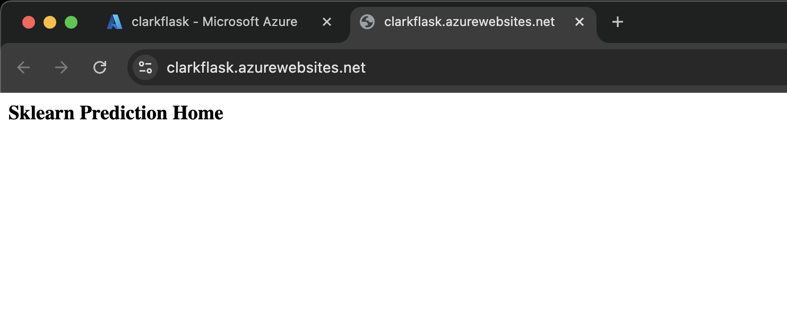
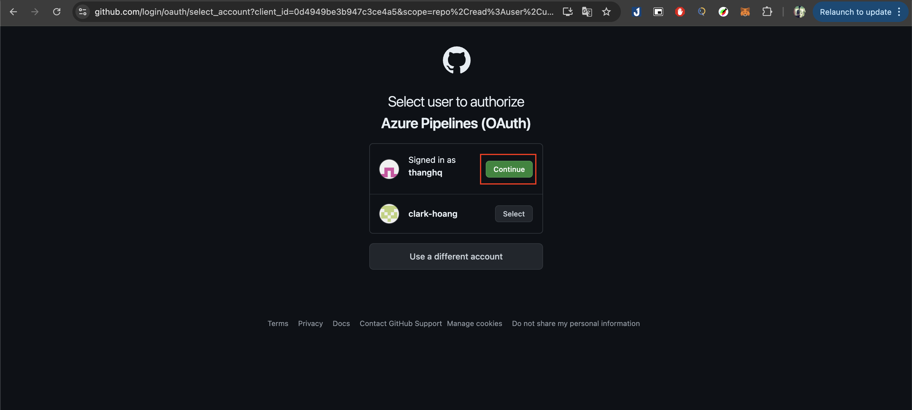
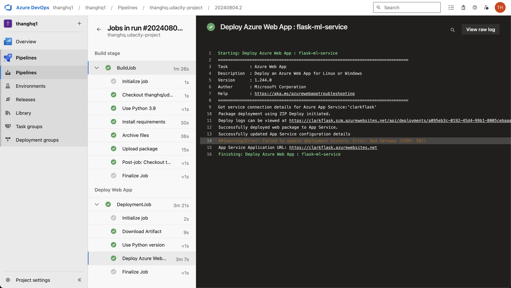

# udacity-project

[](https://github.com/thanghq/udacity-project/actions/workflows/main.yml)

# Overview

This project aims to predict housing prices using machine learning techniques. The dataset includes various features related to housing properties, and the goal is to build a predictive model that can accurately estimate housing prices based on these features.

## Project Plan

* [Trello board](https://trello.com/invite/b/66af281765256e275f7768ab/ATTI9d35ff5507b9e98516eecaf31fe802315D42B103/udacity-project).
* [Project Plan - Spread sheet](https://docs.google.com/spreadsheets/d/1EoK3Hnt4g_B5xVHTstJAqLOM0Sxi1cDtSNUjWLBKKH4/edit?usp=sharing).

## Instructions

### Architectural: 

* Architectural Diagram


### How to start project:

1. Login into azure portal and open cloud shell
2. Create SSH key and add into your github account setting
3. Fork this repo to your github account
4. Clone your fork repo to azure via cloud shell
* Project cloned into Azure Cloud Shell

5. Go to project folder you just cloned and run these commands below:
```bash
python3 -m venv ~/.azure-devops
source ~/.azure-devops/bin/activate
```
6. Install dependencies with ```pip install -r requirements.txt```
7. Run lint and test with  ```make all```
* Passing tests that are displayed after running the `make all` command from the `Makefile`


8. Run project from cloud shell with commands below:
```bash
export set FLASK_APP=app.py
flask run
```
* Project running from cloud shell


9. Open new session and test prediction with 
```bash
cd udacity-project
./make_prediction.sh
```
* Result should look like


10. Create an app service with command (Note that `app-name` is your application name and should be unique, `your-resource-group` is name of your resource group): 
`az webapp up --sku F1 -n <app-name> --resource-group <your-resource-group>`
* Create app service

* Project running on Azure App Service


11. Open new session and test prediction with 
```bash
cd udacity-project
./make_predict_azure_app.sh
```
* Result should look like


12. Create pipeline in azure devops
* Create pipeline

* Choose github

* Authorize az devops to access github

* Choose the project

* Review your `azure-pipelines.yml` file, Save your pipeline first.

* Create Service connection to connect to azure cloud

* Choose Azure Resource Manager

* Choose Service Principal (manual)

* Fill information and save the service connection


13. Go back to `azure-pipelines.yml` file, update `azureServiceConnectionId` with your service connection name and `webAppName` with your app service name
* Successful deploy of the project in Azure Pipelines. 


* Running Azure App Service from Azure Pipelines automatic deployment


*  Output of streamed log files from deployed application


## Enhancements
TOBE Enhance in future: 
* Add API for user to upload pricing data
* Add feature to read data from multiple formats, ex: excel, json, text...
* Add frontend for user to interact with API
* Show prediction with insight in multiple formats (chart, table,...)

## Demo 

[Demo Video - step by step](https://youtu.be/vZnvH0OXGts)
